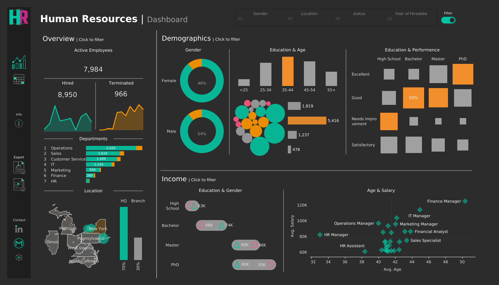
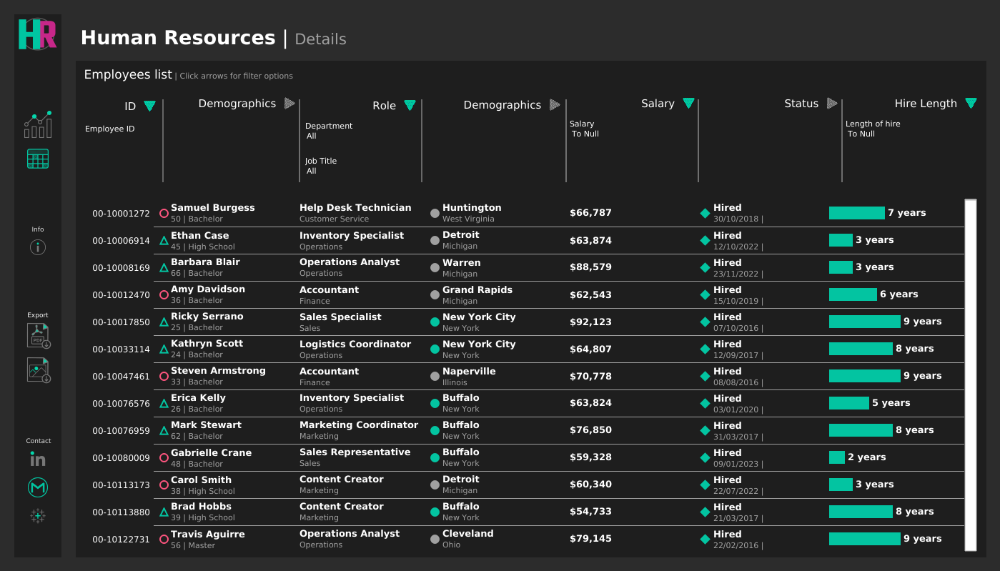

# 📊 HR Dashboard Project

This repository contains the development process, requirements, and final outputs for the **HR Dashboard** built in Tableau. The project is based on business requirements defined in the **HR Dashboard User Story** and aims to provide actionable insights into workforce demographics, income analysis, and employee records.

---

## 📂 Project Files
- **HR Dashboard Preparation Process.pdf** → Step-by-step documentation of data preparation, validation, and dashboard creation phases.  
- **HR Dashboard User Story.pdf** → Business requirements and user expectations for the HR dashboard.  
- **hrdashboard_summary.png** → Summary view of the HR Dashboard (Overview, Demographics, and Income Analysis).  
- **hrdashboard_detailed.png** → Detailed view with employee records and filtering capabilities.  

---

## 🎨 Dashboard Theme
- **Background Color:** `#1E1E1E`  
- **Accent Color:** `#00BFFF`  

This theme ensures clarity, readability, and a professional look.

---

## 🚀 Dashboard Link
🔗 [View the Interactive HR Dashboard on Tableau Public](https://public.tableau.com/app/profile/soyel.hossain/viz/HRDashboard_17558508464700/HRSummary?publish=yes)

---

## 📑 Dashboard Structure

### 1. **Summary View**
- **Overview:**  
  - Total hired, active, and terminated employees  
  - Hires vs. terminations over time  
  - Employees by department and job titles  
  - HQ (New York) vs. branch comparison  
  - Distribution by city and state  

- **Demographics:**  
  - Gender ratio  
  - Age group & education distribution  
  - Employee count by age and education level  
  - Correlation between education background & performance  

- **Income Analysis:**  
  - Salary comparison across education levels (by gender)  
  - Salary correlation with age (by department)  

### 2. **Employee Records View**
- Full employee dataset with:  
  - Name, department, position, gender, age, education, salary  
- Interactive filtering across all available columns  

---

## 📸 Dashboard Snapshots
### 🔹 Summary View

### 🔹 Detailed Employee Records View

---

## ✅ Outcome
- Aligns with HR Dashboard User Story  
- Provides accurate, validated, and meaningful insights  
- Delivers a consistent and professional design  
- Enhances user experience with interactivity and clarity  

---

👤 **Author:** Soyel Hossain  
📌 Built with **Tableau Public**  

